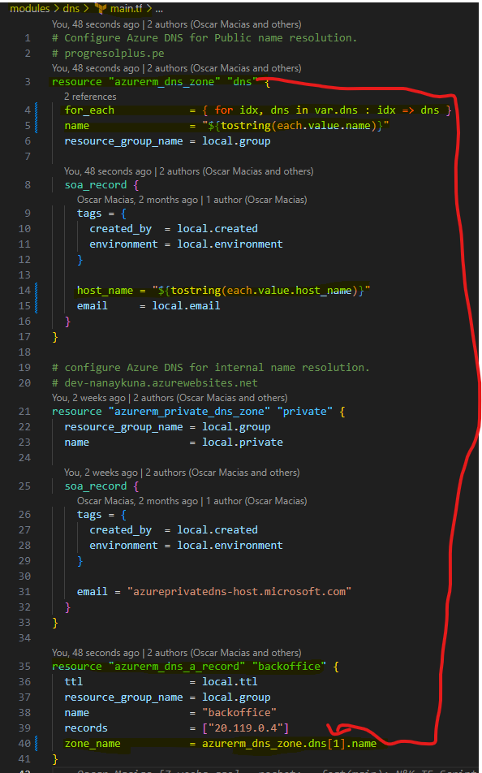
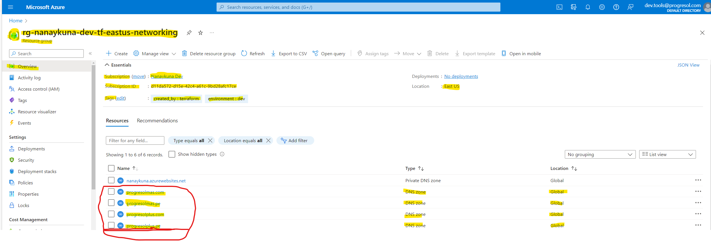

# Changelog

## Version [1.1.0]

Initial release

### Date: 26/03/2023

- Deploy: Many instances for a list with the names of all the current Azure Infrastructure Nanaykuna for every environment.
- Integrate: Networking, Apps, Storage on Module for deploy.

### Date: 04/07/2023

- Update : Networking, Apps, Storage, Monitoring, SQL, DNS on Module for deploy.
- Migrate: true for the new instances with the script from this module.

## Version [1.2.0]

### Date: 07/07/2023

- Integrate: Add Environment Variable "ASPNETCORE_ENVIRONMENT" for Application Settings in every Linux Web App with DotNet & Node.
- Integrate: Random String on Module Apps in Nanaykuna for nexts deploys.

- Integrate: Add Environment Variable "API_KEY_SECRET" for Application Settings in every Linux Web App with DotNet & Node.

## Version [1.3.0]

### Date: 19/07/2023

- Update: Add a new Azure architecture for future and new deploys, about in use with functions length, variables as a type of list of strings by loops in count, with a index interpolation with local variables for Output in Resource.

- Update: Add a new Azure architecture for future and new deploys, about in use with function for, variables as a type of list of objects by loops for every property with type of string in foreach, with a index changed to string more interpolation with local variables for Output in Object and Resource.

### Date: 21/07/2023

- Update: Add a new Azure architecture for future and new deploys, about in use with function for, variables as a type of list of objects by loops for every property with type of string in foreach, with a index changed to string more interpolation with local variables for Output in Object and Resource for a new Resource or depend.

### Date: 16/11/2023

- Change: Exclude dns module as a feature of deploy only in prod's environment. Because in the others it's not required to include in the script or manifest tf config.

